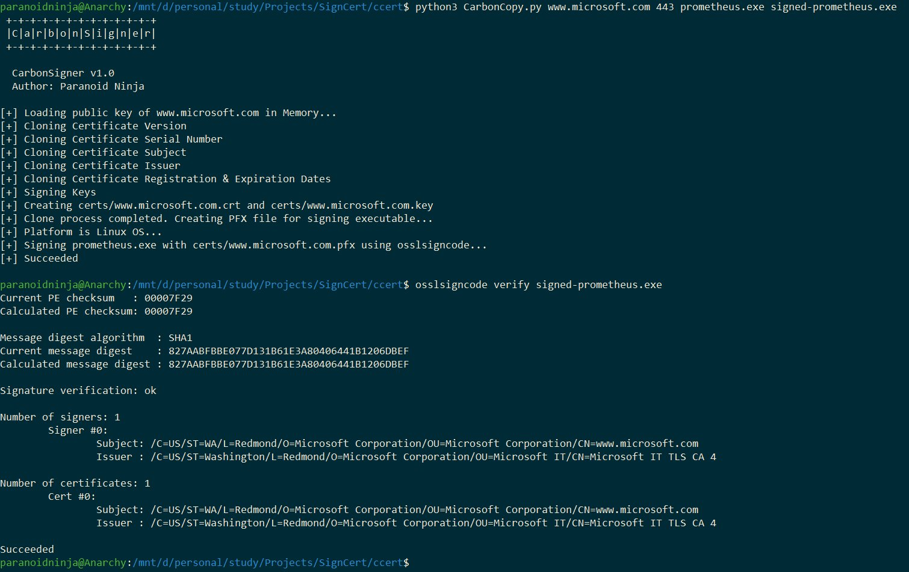

# ShadowPrint
A tool which creates a spoofed certificate of any online website and signs an Executable for AV Evasion. Works for Windows, Linux, and macOS.



## Prerequisites

For Linux, execute:

```shell
sudo apt-get install osslsigncode
pip3 install pyopenssl
```

For macOS (assuming Homebrew is installed), execute:

```shell
brew install osslsigncode
pip install pyopenssl
```

Note: A new version, ShadowPrint_v2.py, has been created with additional features like support for local certificate files, configurable options, and better platform handling.
